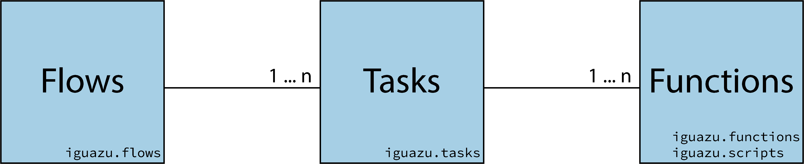

.. _`Key concepts`:

============
Key concepts
============

   The three key concepts of Iguazu and how they are related.

Functions
=========

**Functions** are regular Python functions that do one specific operation (they
could be classes, but in most cases they should be functions).

These functions are *Iguazu-oblivious*: they do not use any Iguazu code or
anything in a ``iguazu.*`` module. In some cases, where the reusability has
been identified and is *really necesssary*, these functions belong in the
`datascience utils <https://github.com/OpenMindInnovation/datascience_utils>`_
package.

Functions are very specific. They should *do one thing and do it well™*.
For example: band-pass filter a signal.

Put as many of these functions as needed on the :py:mod:`iguazu.functions`
module.
Currently, we are organizing it as sub-modules according to the data
modality.

Tasks
=====

**Tasks** are classes whose responsibility is to call one or several
Functions_ using inputs from another tasks, manage the parameters of
these tasks, and generate outputs that may be used by other tasks.
Tasks are the parallelizable unit of Iguazu.

Task classes extend :py:class:`iguazu.core.tasks.Task`, or
``prefect.Task``. Due to the ongoing effort to generalize our task code
and to **don't-repeat-yourself (DRY™)**, you should prefer the former
base class.

Tasks encapsulate complicated operations. It also determines a trade-off between
**(i)** implementing everything as a function, which complexifies functions and
reduces re-usability, and **(ii)** implementing everything as tasks, which needs
passing heavy objects between tasks and is detrimental to memory usage.
An example of a task is to pre-process a signal (a combination of filtering
functions, simple artifact detection, etc.).

Put as many of these classes as needed on the :py:mod:`iguazu.tasks`.
module.
Currently, we are organizing it as sub-modules according to the data
modality.

Flows
=====

**Flows** are classes that orchestrate one or several Tasks_. They can even
combine other reusable flows. Flows are the final product of Iguazu; it is the
object that is deployed and will be scheduled to run at certain times, or the
object that a developer will run a processing pipeline.

Flows are general, they deal with large amount of work, how it is divided,
and how everything is coupled together.
For example: the complete galvanic feature extraction pipeline.

Flow classes extend :py:class:`iguazu.core.flows.PreparedFlow`.
Create flows following the :ref:`Creating new flows` guide and put them on the
:py:mod:`iguazu.flows` module.
Currently, we are organizing it as sub-modules according to the data
modality.
